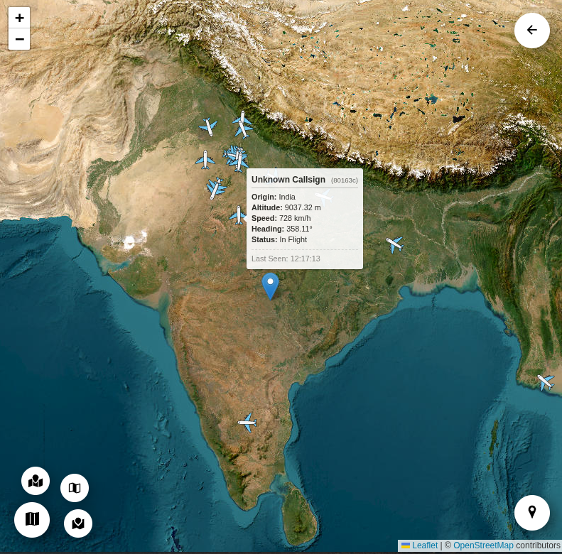

# ✈️ Flight Tracker: Real-Time Aviation Tracker
Flight Tracker is a full-stack flight visualization platform that monitors live aircraft movements across the globe. By leveraging real-time transponder data and event-driven architecture, the application provides a smooth, "radar-like" experience for tracking thousands of flights simultaneously.

## 🚀 Key Technical Features
- Real-Time Data Streaming: Implemented Server-Sent Events (SSE) in Node.js to push live flight vectors to the frontend, reducing overhead compared to traditional polling.

- High-Frequency Updates: Synchronizes with the API to track icao24 identifiers, ground speeds, altitudes, and headings.

- Dynamic Geospatial Visualization: Utilizes the OpenStreetMap API (or Leaflet) to render aircraft with real-time heading rotations and interactive flight path tracing.

- Optimized Data Pipeline: Features a backend mapping utility that transforms raw 2D state vectors into typed, consumable objects for a responsive React UI.

- Efficient State Management: Handles frequent UI re-renders using optimized React hooks to ensure a stutter-free mapping experience even with 1,000+ active markers.

## Built with

The list of major framework/libraries used to bootstrap this project.

* 
* 
* 
* 
* 
* 
* 
* 
* 

## 🛠️ Tech Stack

- Frontend: React, Tailwind CSS, OpenStreetMap

- Backend: Node.js, Express

- Data Protocol: Server-Sent Events (SSE)

## Preview

